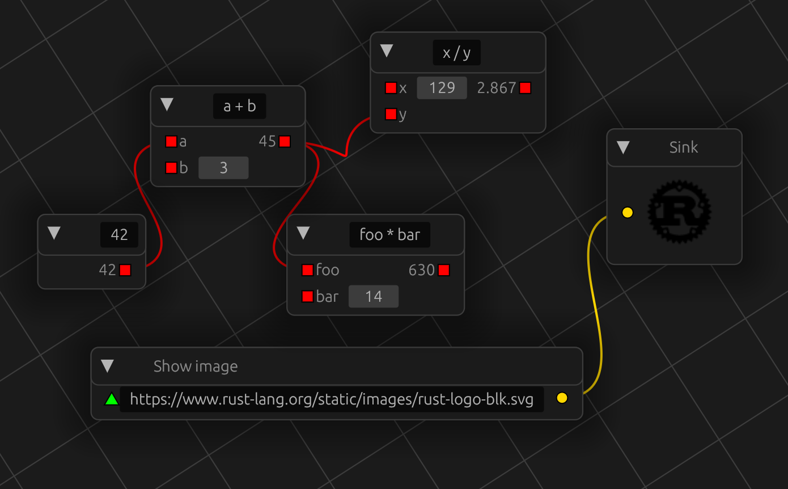

# egui-snarl 

Crate for creating node-graph UIs.
This is in early development. Many more features are planned.

# Why "snarl"?

Because that's how any complex visual graph looks like.

# Features

- Typed data-only nodes.
  `Snarl` is parametrized by the type of the data nodes hold.
  This type may be an enum of the node variants or customizeable node constructor type,
  it's always author's choice.

- Viewer trait to define behavior and add extra data to UI routine.
  `SnarlViewer` trait is parametrized by the type node type.
  It decides node's title UI, how many pins node has and fills pin's UI content.
  Demo example showcase how pin can have drag integer value, text input, button or image,
  there's no limitations since each pin's content is whatever viewer puts in provided `egui::Ui`.

- Node layout is divided to five spaces with both pre-defined and custom content.
  1. Header - top of the node, features collapsing button if `SnarlStyle::collapsible` is true and user-defined content - label with node name by default.
  2. Input pins are placed on the left below the header.
     Each pin contains a shape on the left edge, shape can be intracted with to connect/disconnect the pin and user-defined content after it.
  3. Body of the node is placed in the center, it is optional but comes in handy for some node kinds. Contains only user-defined content.
  4. Output pins are placed on the right below the header.
     Same as input pins but pin shape goes to the right edge.
  5. Footer is placed below other spaces, similar to body it is optional and contains only user-defined content.

- Context menus for nodes and graph background.
  Right-clicking on node, if configured, opens context menu filled by viewer's method. The method is provided with `Snarl` reference and node index. It may be used to add menu options to remove node, configure it or anything else.
  Right-clicking on background, if configured, opens context menu filled by viewer's method. The method is provided with `Snarl` reference. It may be used to add/remove nodes configure whole graph or anything else.

- UI scaling.
  `egui` does not support UI scaling, but to provide best UX `egui-snarl` supports scaling
  via scaling of independent UI elements, this works with some artefacts.

- User controlled responses for wire connections.
  When new wire is connected in UI the viewer is notified and decides what happens.
  It may create that connection, ignore it, add more nodes, play beep sound or send e-mails.

- Multiconnections.
  Connect or reconnect many pins at once.
  When dragging new wire, hover over pin of the same side while holding Shift to add wire from it into bundle.
  Start dragging from pin while holding Ctrl (Cmd on Macos) to yank existing wires from it and drag in to another pin.

- Beautiful wires between nodes.
  `egui-snarl` use carefuly crafted formula to draw wires that can be customized to scale differently using `SnarlStyle`.

- Configurable background pattern.
  Having blank color background may be desirable, however some faint background with pattern helps filling visual emptiness.
  Configure background in `SnarlStyle`, use provided patterns like `Grid` or custom function.

- Serialization.
  `Snarl` structure stores only the graph with placed nodes and wires between them.
  This makes it suitable for easy serialization and deserialization.
  It supports `serde` so pick your own format.

# Example

`demo` example shows some of the features of the crate.

